# CarbonRoute — High-Level Design

## 1. Overview

CarbonRoute is a **Software-Defined Networking (SDN) based routing framework** that selects network paths by jointly considering:

* End-to-end latency
* Network energy consumption
* Carbon intensity and estimated carbon emissions

Traditional routing algorithms primarily optimize metrics such as hop count or shortest latency. CarbonRoute extends this approach by introducing a configurable multi-objective routing model that evaluates the environmental impact of network paths alongside Quality of Service (QoS).

The system uses an SDN architecture where the routing decision logic is separated from the low-level network control layer.

---

## 2. System Goals

CarbonRoute aims to:

1. Build a network with multiple possible paths between hosts.
2. Collect network performance metrics from the SDN environment.
3. Estimate energy consumption for network links and switches.
4. Calculate estimated carbon emissions based on energy consumption and carbon intensity.
5. Compute routes using a multi-objective cost function.
6. Compare CarbonRoute against conventional shortest-path routing.
7. Dynamically update routing decisions when network conditions change.
8. Visualize network state, selected routes, and experimental results.

---

## 3. Technology Stack

| Layer             | Technology              |
| ----------------- | ----------------------- |
| Frontend          | Next.js + TypeScript    |
| Backend           | Go                      |
| HTTP Framework    | Echo                    |
| Routing Engine    | Go                      |
| SDN Controller    | Python + Ryu            |
| Network Emulator  | Mininet                 |
| Virtual Switches  | Open vSwitch            |
| Network Protocol  | OpenFlow                |
| Database          | PostgreSQL              |
| Real-Time Updates | WebSocket               |
| Containerization  | Docker / Docker Compose |

---

# 4. High-Level Architecture

The system is divided into five major layers:

1. **Presentation Layer**
2. **Application and Decision Layer**
3. **SDN Control Layer**
4. **Network Emulation Layer**
5. **Persistence Layer**

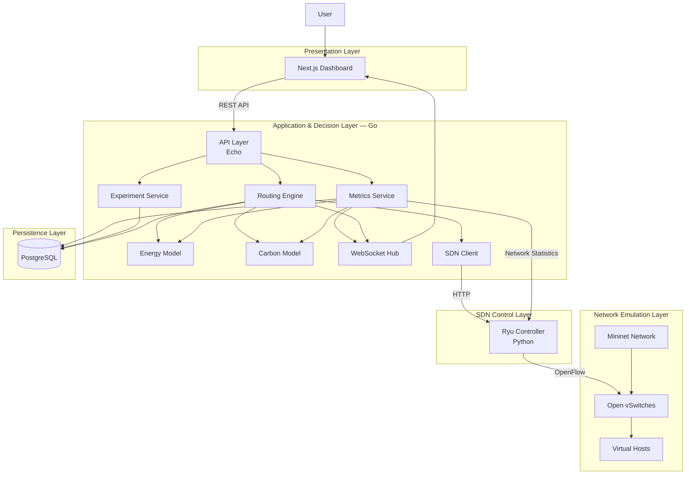

---

# 5. Architectural Responsibilities

## 5.1 Next.js Dashboard

The frontend provides a visual interface for interacting with CarbonRoute.

### Responsibilities

* Display network topology.
* Display the currently selected route.
* Show latency, energy, and carbon metrics.
* Configure optimization weights.
* Start experiments.
* Compare CarbonRoute against shortest-path routing.
* Receive live updates through WebSockets.

### Major Screens

```text
Dashboard
│
├── Network Overview
│   ├── Live Topology
│   ├── Selected Route
│   └── Network Health
│
├── Route Optimizer
│   ├── Source/Destination
│   ├── Optimization Weights
│   └── Route Comparison
│
├── Experiment Lab
│   ├── Scenario Selection
│   ├── Algorithm Selection
│   └── Experiment Execution
│
└── Results
    ├── Latency Comparison
    ├── Energy Comparison
    ├── Carbon Comparison
    └── Throughput Comparison
```

---

## 5.2 Go Backend

The Go backend acts as the primary **application and decision layer**.

It does not directly control OpenFlow switches.

Instead, it:

```text
Collects network state
        ↓
Builds network graph
        ↓
Calculates routing metrics
        ↓
Runs optimization algorithm
        ↓
Selects optimal path
        ↓
Sends selected path to Ryu
```

### Major Components

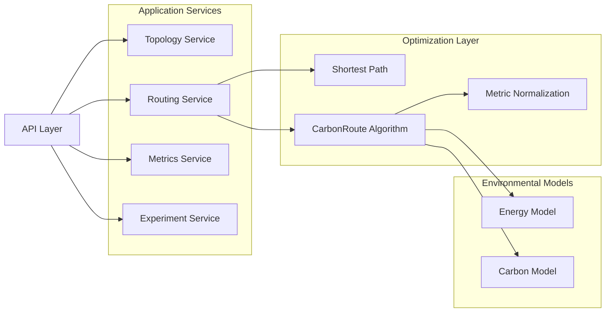

---

# 6. Core System Components

## 6.1 Topology Service

The Topology Service maintains an in-memory representation of the SDN network.

The topology is periodically retrieved from the Ryu controller.

### Example Network

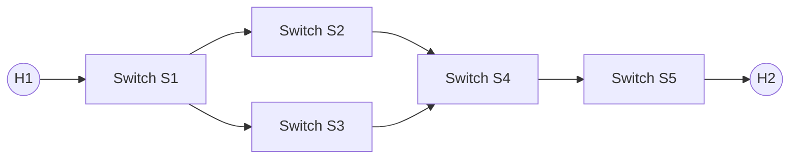

The topology is converted into a graph used by the routing engine.

---

## 6.2 Metrics Service

The Metrics Service periodically collects network statistics.

### Collected Metrics

| Metric      | Description                            |
| ----------- | -------------------------------------- |
| Latency     | Estimated or measured link delay       |
| Throughput  | Traffic successfully transmitted       |
| Utilization | Percentage of link capacity being used |
| Packet Loss | Percentage of packets dropped          |
| Bandwidth   | Available link capacity                |

### Collection Flow

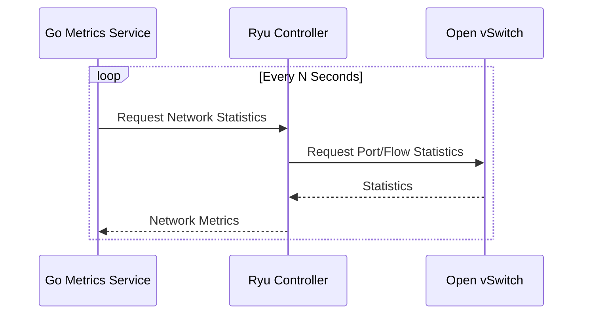

The collected data is used to update the network graph and calculate energy and carbon metrics.

---

# 7. Routing Architecture

CarbonRoute supports two routing strategies.

## 7.1 Baseline Routing

The baseline algorithm uses conventional shortest-path routing.

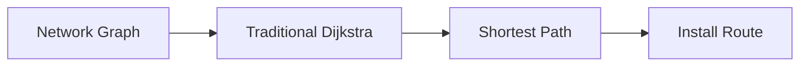

The baseline is used for comparison with CarbonRoute.

---

## 7.2 CarbonRoute Routing

CarbonRoute calculates an edge cost using normalized values of:

* Latency
* Energy
* Carbon emissions

### Cost Function

```text
Cost(e) =
    α × L(e)
  + β × E(e)
  + γ × C(e)
```

Where:

```text
α = Latency Weight
β = Energy Weight
γ = Carbon Weight

α + β + γ = 1
```

### Routing Pipeline

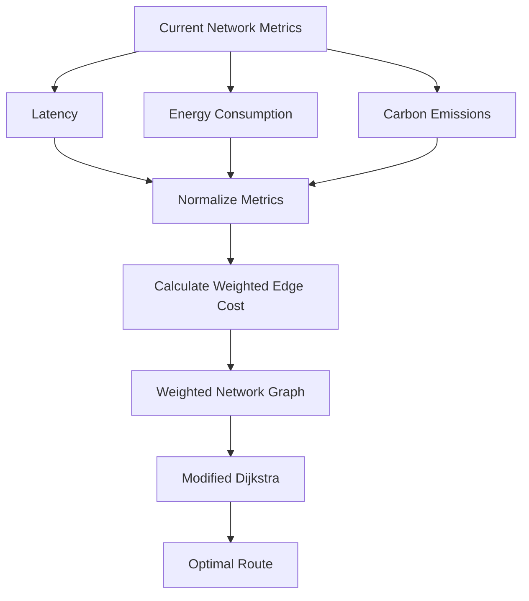

---

# 8. Energy and Carbon Calculation

## 8.1 Energy Model

Energy consumption is estimated using network utilization.

```text
P = P_idle + U × (P_max - P_idle)
```

Where:

| Variable | Meaning                   |
| -------- | ------------------------- |
| `P`      | Current power consumption |
| `P_idle` | Idle power consumption    |
| `P_max`  | Maximum power consumption |
| `U`      | Network utilization       |

Energy consumed during a time interval:

```text
E = P × t
```

---

## 8.2 Carbon Model

Estimated carbon emissions are calculated as:

```text
Carbon Emissions = Energy Consumption × Carbon Intensity
```

For a complete path:

```text
Path Carbon = Σ Carbon Emissions of Path Components
```

Carbon intensity can initially be simulated and dynamically modified during experiments.

---

# 9. Route Installation Flow

After the Go routing engine selects a path, the route must be installed in the network.

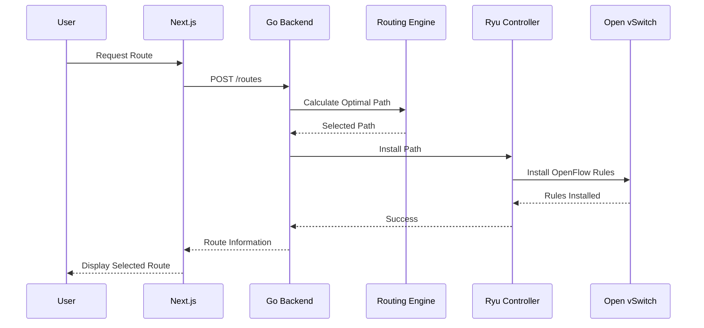

---

# 10. Dynamic Re-Routing

CarbonRoute periodically re-evaluates the selected route.

A route may be recalculated when:

* Network latency increases.
* Link utilization increases.
* Energy consumption changes.
* Carbon intensity changes.
* The current path becomes significantly less optimal.

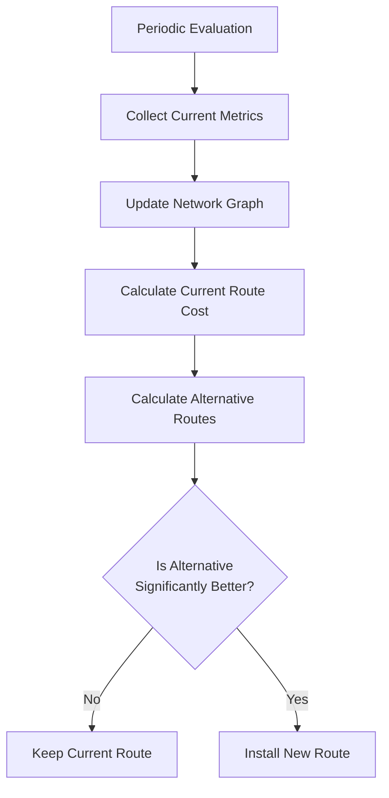

To prevent route flapping, a new route is only selected if its improvement exceeds a configurable threshold.

---

# 11. Experiment Architecture

The Experiment Service automates comparisons between algorithms.

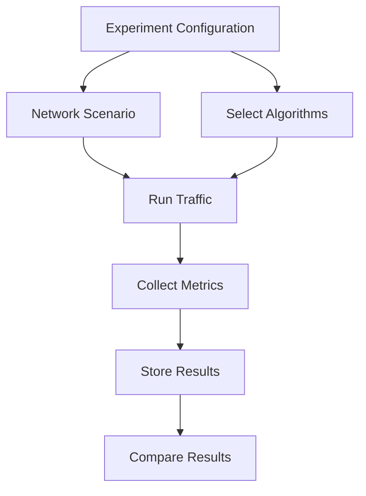

---

# 12. Experiment Scenarios

The system will support the following scenarios.

## Scenario 1 — Normal Network

```text
Stable latency
Stable carbon intensity
Normal traffic
```

Purpose:

Compare baseline shortest-path routing with CarbonRoute under normal conditions.

---

## Scenario 2 — High Carbon Path

```text
Shortest Path
Carbon Intensity: High

Alternative Path
Carbon Intensity: Low
```

Expected behavior:

```text
CarbonRoute should select the cleaner path
even if it has slightly higher latency.
```

---

## Scenario 3 — Network Congestion

```text
Traffic Load
      ↓
High Utilization
      ↓
Increased Latency
      ↓
Higher Energy Cost
      ↓
Route Re-evaluation
```

---

## Scenario 4 — Optimization Weight Analysis

Three predefined optimization profiles are used.

| Mode        | Latency | Energy | Carbon |
| ----------- | ------: | -----: | -----: |
| Performance |    0.70 |   0.20 |   0.10 |
| Balanced    |    0.40 |   0.30 |   0.30 |
| Green       |    0.15 |   0.35 |   0.50 |

The experiment evaluates how changing priorities affects:

* Latency
* Energy consumption
* Carbon emissions
* Throughput
* Packet loss

---

# 13. Data Persistence

PostgreSQL stores historical experiment and routing data.

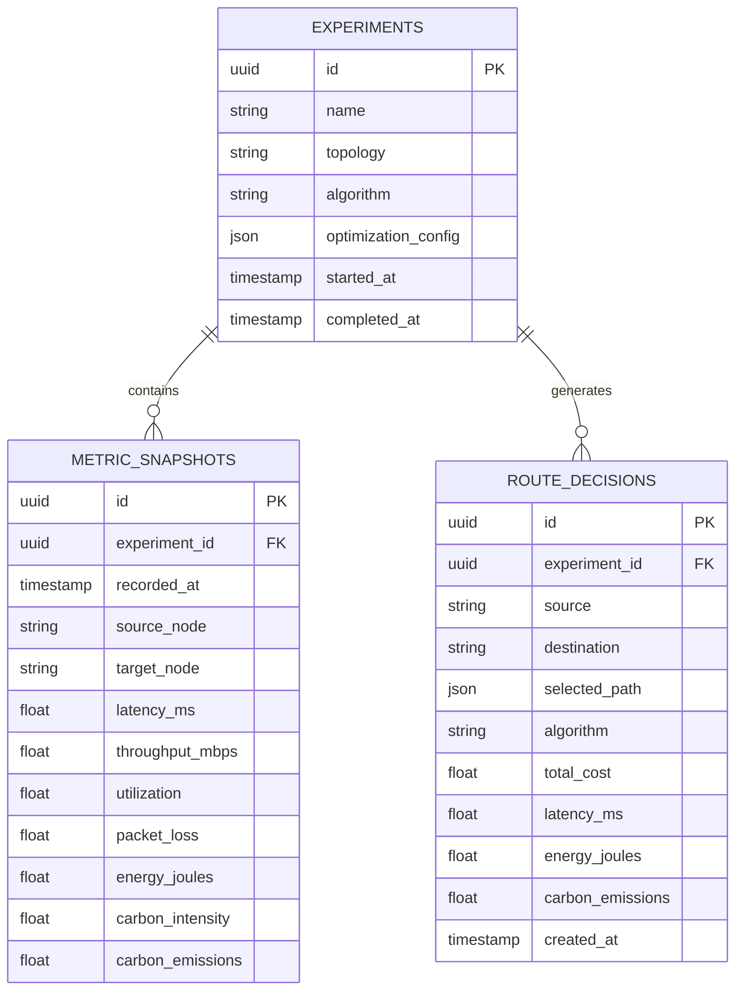

---

# 14. Data Flow

The complete data flow through CarbonRoute is:

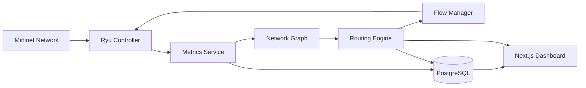

---

# 15. External Service Communication

The system uses simple HTTP communication between the Go backend and Ryu controller.

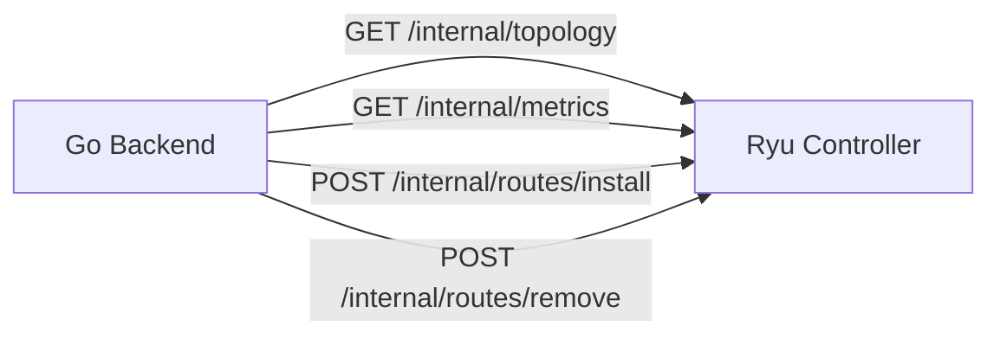

This keeps the SDN controller isolated from the application logic.

---

# 16. API Boundaries

## Frontend → Go Backend

```text
GET  /api/topology

GET  /api/metrics

GET  /api/routes/current

POST /api/routes/calculate

POST /api/optimization

POST /api/experiments

GET  /api/experiments/:id

GET  /api/experiments/:id/results

WS   /api/ws
```

---

## Go Backend → Ryu Controller

```text
GET  /internal/topology

GET  /internal/metrics

POST /internal/routes/install

POST /internal/routes/remove
```

---

# 17. Deployment Architecture

For development, the system runs as separate services.

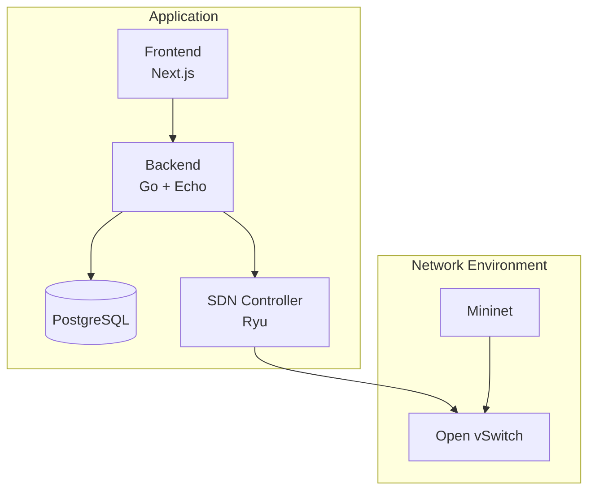

---

# 18. Proposed Repository Structure

```text
carbonroute/

├── frontend/
│   ├── app/
│   ├── components/
│   ├── hooks/
│   └── lib/
│
├── backend/
│   ├── cmd/
│   │   └── server/
│   │       └── main.go
│   │
│   ├── internal/
│   │   ├── api/
│   │   ├── routing/
│   │   ├── topology/
│   │   ├── metrics/
│   │   ├── energy/
│   │   ├── carbon/
│   │   ├── experiments/
│   │   ├── sdn/
│   │   ├── repository/
│   │   └── websocket/
│   │
│   ├── migrations/
│   └── Dockerfile
│
├── sdn-controller/
│   ├── app.py
│   ├── topology/
│   ├── flows/
│   ├── stats/
│   └── api/
│
├── network/
│   ├── topologies/
│   └── traffic/
│
├── deployments/
│   └── docker-compose.yml
│
├── docs/
│   ├── HLD.md
│   ├── LLD.md
│   └── API.md
│
└── README.md
```

---

# 19. Design Decisions

| Decision                | Rationale                                                                     |
| ----------------------- | ----------------------------------------------------------------------------- |
| Go for backend          | Strong concurrency and clean systems programming                              |
| Ryu for SDN             | Rapid OpenFlow and SDN development                                            |
| Mininet                 | Controlled and reproducible network experiments                               |
| PostgreSQL              | Persistent storage for experiments and metrics                                |
| No Redis                | The current project does not require distributed caching or message brokering |
| HTTP between Go and Ryu | Simple, debuggable service boundary                                           |
| WebSocket for UI        | Real-time topology and metric updates                                         |
| In-memory graph         | Fast path calculations using the latest network state                         |

---

# 20. Final Architecture Summary

CarbonRoute follows a clear separation of responsibilities:

```text
Next.js
    │
    │ Visualization + User Interaction
    ▼
Go Backend
    │
    ├── API Layer
    ├── Metrics Collection
    ├── Energy Calculation
    ├── Carbon Calculation
    ├── Routing Optimization
    └── Experiment Management
    │
    │ Selected Path
    ▼
Ryu Controller
    │
    │ OpenFlow Rules
    ▼
Open vSwitch
    │
    ▼
Mininet Network
```

The central architectural principle is:

> **Go decides the optimal route. Ryu translates that decision into OpenFlow rules. Mininet executes and evaluates the resulting network behavior.**

This separation allows CarbonRoute to independently evolve the routing algorithm, network controller, and visualization layers while maintaining a clear and testable system architecture.
